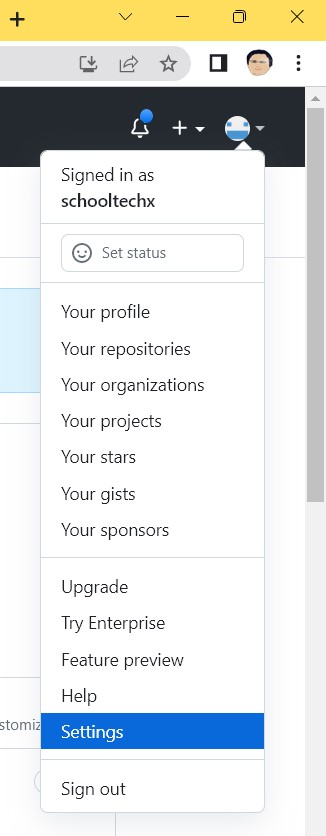
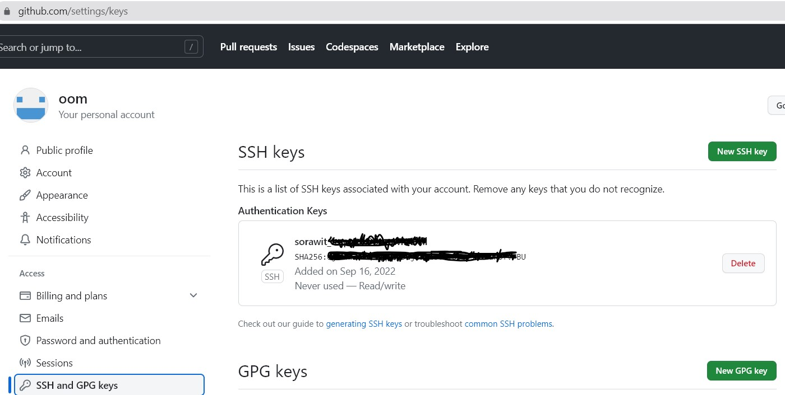
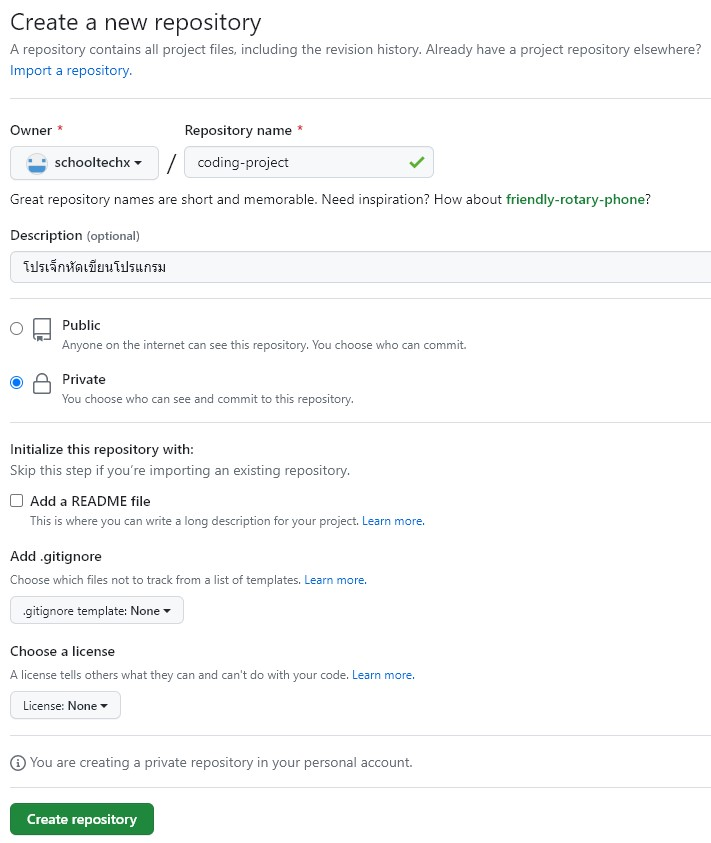
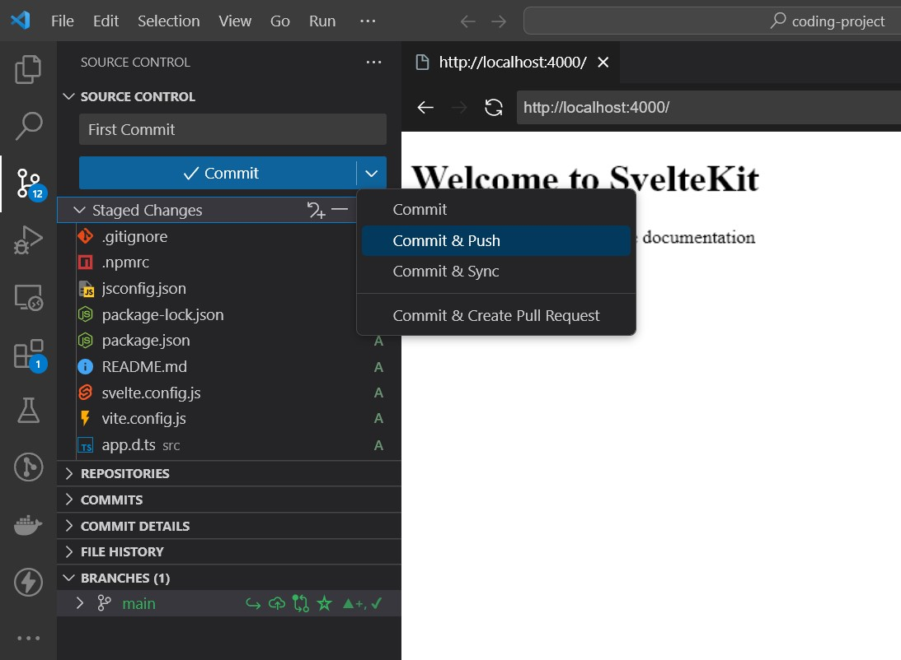

# การตั้งค่า Github
Git เป็นเครื่องมือที่จำเป็นอย่างมากสำหรับนักพัฒนาซอฟแวร์ในปัจจุบัน ใช้ในการบริหารจัดการโค้ด เช่นคุมเวอร์ชั่น สามารถย้อนไปรุ่นก่อนหน้า เปรียบเทียบความแตกต่าง ทำงานเป็นทีมได้ง่าย ฯลฯ ในเอกสารนี้จะแสดงวิธีการติดตั้งและนำโค้ดขึ้น Github แบบง่ายๆ 

## เตรียมตัว
- [ให้สมัครใช้งาน Github](https://github.com/)
- สำหรับวินโดว์ให้[ติดตั้ง Git](https://github.com/git-guides/install-git)
- [ติดตั้ง VS Code](https://code.visualstudio.com/download) พร้อม Extension
  - Git Graph
  - GitHub Pull Requests and Issues
  - GitHub Repositories
- สำหรับผู้ใช้วินโดว์ 10 แนะนำให้ติดตั้ง [Windows Terminal](https://github.com/microsoft/terminal/releases) ด้วย (วินโดว์ 11 มีให้แล้ว)

## สร้าง SSH Key
SSH Key เป็นกุญแจสำหรับเข้าใช้ระบบโดยไม่ต้องใช้รหัสผ่าน มีการสื่อสารแบบเข้ารหัส นิยมใช้กับ ssh บน Linux จะเก็บ Private Key 
ไว้ในเครื่อง Desktop/Laptop ที่เราใช้งานอยู่(Local)
ส่วนเซิร์ฟเวอร์ (Remote) ที่จะเข้าใช้เก็บ Public Key
- สร้าง [SSH key](https://docs.github.com/en/authentication/connecting-to-github-with-ssh/generating-a-new-ssh-key-and-adding-it-to-the-ssh-agent) 
 ด้วยคำสั่ง(แก้อีเมลล์ให้เหมาะสม) ssh-keygen -t ed25519 -C "your_email@example.com"
- ใส่ชื่อไฟล์ในตัวอย่างตั้งชื่อ id_github ถ้ายังไม่เคยสร้างมาก่อน แนะนำให้ตามค่า default ไปก่อนเพราะจะสร้างโฟลเดอร์ .ssh ให้ด้วย
- Enter passphrase ให้เคาะผ่านไม่ต้องป้อน แล้วเคาะผ่านอีกรอบ
- ตัวอย่างด้านล่างทำบนวินโดว์ ส่วน macOS และ Linux ก็ทำคล้ายกัน
``` 
PS C:\dev\test> ssh-keygen -t ed25519 -C "your_email@example.com"
Generating public/private ed25519 key pair.
Enter file in which to save the key (C:\Users\oom/.ssh/id_ed25519): id_github
Enter passphrase (empty for no passphrase):
Enter same passphrase again:
Your identification has been saved in id_github.
Your public key has been saved in id_github.pub.
The key fingerprint is:
SHA256:b12g1KqPmX+0BdYF2c0y7wMqaZ7lHk+ABtOmKQzsSVI your_email@example.com
The key's randomart image is:
+--[ED25519 256]--+
|   E          .=.|
|  o     .  .  + =|
| . +   o o. o. = |
|  + +   *..ooo. .|
|   o o oSo+o..o. |
|      . .* +o....|
|        + Bo.+  .|
|         O .*    |
|        +.+o .   |
+----[SHA256]-----+
PS C:\dev\test> dir
    Directory: C:\dev\test

Mode                 LastWriteTime         Length Name
----                 -------------         ------ ----
-a----         4/13/2023  12:01 AM            419 id_github
-a----         4/13/2023  12:01 AM            105 id_github.pub
```
- ย้ายไฟล์ id_github.pub  และ id_github  ซึ่งเป็นกุญแจ สาธารณะ และ ส่วนตัว 
ไปเก็บในโพลเดอร์ .ssh (ถ้าทำตาม default จะนำไปใส่โฟลเดอร์ .ssh ให้เลย) ซึ่งอยู่ใต้โฮมโฟลเดอร์ สมมุติผมใช้ login ชื่อ oom 
โฮมโฟลเดอร์บนวินโดว์จะอยู่ที่ "C:\Users\oom\\.ssh" สำหรับ  
โฮมโฟลเดอร์บน Linux และ macOS จะอยู่ที่ "~/.ssh/" 
- ถ้าขั้นตอนที่ใส่ "id_github" ให้ใส่ "C:\Users\oom\\.ssh\id_github" ก็ไม่ต้องทำขั้นตอนการย้าย
- ในโฟลเดอร์ .ssh เปิดไฟล์ชื่อ config (ถ้ายังไม่มีให้สร้างใหม่ แนะนำให้ใช้ VS Code ในการสร้าง) 
แล้วใส่ 4 บรรทัดนี้ลงไป
```
Host github.com
  HostName github.com
  User git
  IdentityFile ~/.ssh/id_github
```

ต้องตั้งสองค่านี้จะเป็นชื่อและอีเมลล์ที่แสดงเวลาเอาโค้ดขึ้น github
``` bash
git config --global user.name "oom"
git config --global user.email "oom@xxx.com"
```
## เพิ่ม Public Key ใน Github

ให้ทำ[ตามเอกสาร](https://docs.github.com/en/authentication/connecting-to-github-with-ssh/adding-a-new-ssh-key-to-your-github-account) 
ของ Github ทำตามในภาพนี้ เมนูบนขวาเลือก Setting



เลือก SSH and GPG Keys แล้วกดปุ่ม New SSH Key



เอาเนื้อหาในไฟล์ id_github.pub มาใส่ในนี้ แล้วกดปุ่ม Add SSH Key


## สร้าง Repository
ไปที่ Repositories แล้วกดปุ่ม New


สร้าง Repository ถ้าเลือกเป็น Private เราจะเห็นคนเดียว ส่วน Public ทุกคนจะอ่านได้



สร้าง Repository เสร็จแล้ว ให้เปลี่ยนจาก HTTPS ไปเลือก SSH แล้วก็อปค่าเก็บไว้


ทำการ clone โปรเจ็กเปล่า ที่ Terminal ให้เรียกคำสั่ง
``` bash
git clone git@github.com:schooltechx/coding-project.git
cd coding-project
```
โฟลเดอร์นี้ก็จะพร้อมที่จะเอาโค้ดของโปรแกรมมาใส่แล้ว ในโฟลเดอร์ coding-project จะมีโฟลเดอร์ .git ซ่อนอยู่จะมีคอนฟิกต่างๆของ Git

## เอาโค้ดขึ้น github

สามารถนำโค้ดที่ต้องการขึ้น Github มาใส่ในโฟลเดอร์นี้ได้เลย หรืออาจจะใช้วิธีก็อป .git ในโฟลเดอร์ที่ clone ลงมาไปใส่ในโฟลเดอร์โปรเจ็กงานที่ทำอยู่  จะให้เริ่มใช้งานบน VS Code เพราะง่ายกว่าใช้ command line
จะให้ลองสร้างโปรเจ็ก ในตัวอย่างสร้างเวบแอปด้วย SvelteKit ตอนนี้เราอยู่ในโฟลเดอร์ coding-project แล้ว

``` bash
# สร้างโปรเจ็กในโฟลเดอร์นี้เลย กด Enter
# Directory not empty. Continue? ให้ตอบ y 
npm create svelte@latest .
npm install
# เปิดโฟลเดอร์ปัจจุบันด้วย VS Code
code .
```
ตรงเมนู Source Control ที่อยู่ด้านซ้าย จะแสดงโค้ดที่ยังไม่ได้ขึ้น Repository อยู่ใต้คำว่า Changes ให้กดปุ่ม + (Staged All Changes) โค้ดที่พร้อมขึ้นจะย้ายไปอยู่ Staged Changes ตรงช่อง Message ให้ใส่ "First Commit" หรือคำอธิบายอะไรก็ได้ ตรงปุ่มสีฟ้ากดลูกศรลง Commit & Push เท่านี้โค้ดใหม่ของ SvelteKit ก็จะขึ้น Repository แล้ว



ถ้าโค้ดมีการแก้ไขหรือเพิ่มใหม่ก็จะอยู่ใต้คำว่า Changes ให้ทำเหมือนเดิมก็จะเอาขึ้น Repository ตอนนี้โค้ดจะอยู่ใน Branch ชื่อ Main 
แนะนำให้ดูเรื่องการสร้างไฟล์ [.gitignore](https://www.atlassian.com/git/tutorials/saving-changes/gitignore) ของแต่ละภาษาและ Framework เพื่อจะได้ไม่ต้องเอาไฟล์ที่ไม่จำเป็นขึ้น Repository


## เพิ่มเติม

สำหรับการสำเนา private key ไปเครื่องอื่นหรือคอนฟิกที่เกี่ยวกับ ssh จะทำให้สิทธิ์ที่ควรเป็นหายไป จะทำให้ใช้งานไม่ได้ ต้องกำหนดสิทธิ์ใหม่ ให้ยูสเซอร์เจ้าของอ่านได้คนเดียว ไม่ควรให้ group และ other อ่านได้ บน Linux ให้ใช้คำสั่ง
```
chmod og-rw my_key
```
สำหรับวินโดว์การกำหนดสิทธิ์[ต้องทำดังนี้](https://superuser.com/questions/1296024/windows-ssh-permissions-for-private-key-are-too-open)
